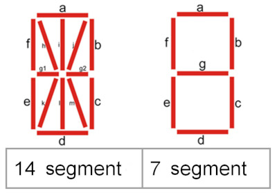
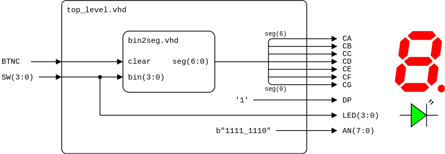
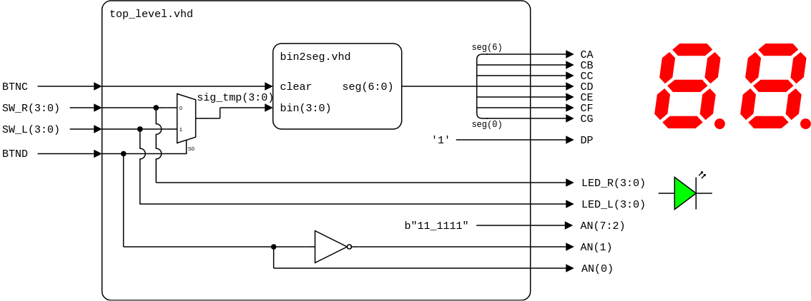

# Lab 3: Seven-segment display decoder

* [Pre-Lab preparation](#preparation)
* [Part 1: VHDL code for seven-segment display decoder](#part1)
* [Part 2: Structural modeling, instantiation](#part2)
* [Part 3: Top level VHDL code](#part3)
* [Challenges](#challenges)
* [References](#references)

### Learning objectives

* Use 7-segment display
* Use VHDL processes
* Understand the structural modeling and instantiation in VHDL

<a name="preparation"></a>

## Pre-Lab preparation

The Nexys A7 board provides two four-digit common anode seven-segment LED displays (configured to behave like a single eight-digit display).

1. See [schematic](https://github.com/tomas-fryza/vhdl-labs/blob/master/docs/nexys-a7-sch.pdf) or [reference manual](https://reference.digilentinc.com/reference/programmable-logic/nexys-a7/reference-manual) of the Nexys A7 board and find out the connection of 7-segment displays and push-buttons. What is the difference between NPN and PNP type of BJT (Bipolar Junction Transistor).

   

2. Complete the decoder truth table for **common anode** (active low) 7-segment display.

   

   | **Symbol** | **Inputs** | **a** | **b** | **c** | **d** | **e** | **f** | **g** |
   | :-: | :-: | :-: | :-: | :-: | :-: | :-: | :-: | :-: |
   | 0 | 0000 | 0 | 0 | 0 | 0 | 0 | 0 | 1 |
   | 1 | 0001 | 1 | 0 | 0 | 1 | 1 | 1 | 1 |
   | 2 |      |   |   |   |   |   |   |   |
   | 3 |      |   |   |   |   |   |   |   |
   | 4 |      |   |   |   |   |   |   |   |
   | 5 |      |   |   |   |   |   |   |   |
   | 6 |      |   |   |   |   |   |   |   |
   | 7 | 0111 | 0 | 0 | 0 | 1 | 1 | 1 | 1 |
   | 8 | 1000 | 0 | 0 | 0 | 0 | 0 | 0 | 0 |
   | 9 |      |   |   |   |   |   |   |   |
   | A |      |   |   |   |   |   |   |   |
   | b |      |   |   |   |   |   |   |   |
   | C |      |   |   |   |   |   |   |   |
   | d |      |   |   |   |   |   |   |   |
   | E | 1110 | 0 | 1 | 1 | 0 | 0 | 0 | 0 |
   | F | 1111 | 0 | 1 | 1 | 1 | 0 | 0 | 0 |

   > Note that, there are other types of segment displays, [such as 14- or 16-segment](http://avtanski.net/projects/lcd/).
   >
   >  &nbsp; &nbsp; &nbsp; &nbsp;
   > 

<a name="part1"></a>

## Part 1: VHDL code for seven-segment display decoder

The Binary to 7-Segment Decoder converts 4-bit binary data to 7-bit control signals which can be displayed on 7-segment display. A display consists of 7 LED segments to display the decimal digits `0` to `9` and letters `A` to `F`.

1. Run Vivado and create a new project:

   1. Project name: `display`
   2. Project location: your working folder, such as `Documents`
   3. Project type: **RTL Project** (Note, the Register-Transfer Level refers to a level of abstraction used to describe how the data is transferred and processed inside hardware.)
   4. Create a new VHDL source file: `bin2seg`
   5. Do not add any constraints now
   6. Choose a default board: `Nexys A7-50T`
   7. Click **Finish** to create the project
   8. Define I/O ports of new module:
      * `clear`, `in`
      * `bin`, `in`, Bus: `check`, MSB: `3`, LSB: `0`
      * `seg`, `out`, Bus: `check`, MSB: `6`, LSB: `0`

      | **Port name** | **Direction** | **Type** | **Description** |
      | :-: | :-: | :-- | :-- |
      | `clear` | input | `std_logic` | Clear the display |
      | `bin` | input   | `std_logic_vector(3 downto 0)` | Binary representation of one hexadecimal symbol |
      | `seg` | output  | `std_logic_vector(6 downto 0)` | Seven active-low segments from A to G |

2. Use [combinational process](https://github.com/tomas-fryza/vhdl-labs/wiki/Processes) and complete an architecture of the decoder.

   The process statement is very similar to the classical programming language. The code inside the process statement is executed sequentially. The process statement is declared in the concurrent section of the architecture, so two different processes are executed concurrently.

   ```vhdl
   process_label : process (sensitivity_list) is
       -- Declarative part (can be empty)
   begin
       -- Sequential statements
   end process process_label;
   ```

   In the process sensitivity list are declared all the signal which the process is sensitive to. In the following example, the process is evaluated any time a transaction is scheduled on the signal `bin` or `clear`. Inside a process, `case`-`when` [assignments](https://github.com/tomas-fryza/vhdl-labs/wiki/Signal-assignments) can be used.

   ```vhdl
   -- This combinational process decodes binary input (`bin`) into 7-segment display output
   -- (`seg`) for a Common Anode configuration. When either `bin` or `clear` changes, the
   -- process is triggered. Each bit in `seg` represents a segment from A to G. The display
   -- is cleared if input `clear` is set to 1.
   p_7seg_decoder : process (bin, clear) is
   begin

     if (clear = '1') then
       seg <= "1111111";  -- Clear the display
     else

       case bin is
         when x"0" =>     -- x"0" means "0000" in hexadecimal
           seg <= "0000001";
         when x"1" =>
           seg <= "1001111";

         -- WRITE YOUR CODE HERE
         -- 2, 3, 4, 5, 6

         when x"7" =>
           seg <= "0001111";
         when x"8" =>
           seg <= "0000000";

         -- WRITE YOUR CODE HERE
         -- 9, A, b, C, d

         when x"E" =>
           seg <= "0110000";
         when others =>
           seg <= "0111000";
       end case;

     end if;    
   end process p_7seg_decoder;
   ```

3. Create a VHDL simulation source `bin2seg_tb`, copy/paste the [testbench template](https://www.edaplayground.com/x/Vdpu) or [generate it](https://vhdl.lapinoo.net/testbench/), complete all test cases, and verify the functionality of your decoder.

   ```vhdl
   -- Disable clear
   clear <= '0';

   -- Test case 1: Input binary value 0000
   bin <= x"0";
   wait for 50 ns;
   assert seg = "0000001"
     report "0 does not map to 0000001"
     severity error;

   -- WRITE YOUR CODE HERE
   ```

   > **Note:** Test cases can be also generated by a loop. IMPORTANT: In the following example you have to also include `ieee.numeric_std.all` package for data types conversion.
   >
   >   ```vhdl
   >   library ieee;
   >     use ieee.std_logic_1164.all;
   >     use ieee.numeric_std.all; -- Definition of "to_unsigned"
   >
   >   ...
   >   -- Loop for all hex values
   >   for i in 0 to 15 loop
   >
   >     -- Convert decimal value `i` to 4-bit wide binary
   >     bin <= std_logic_vector(to_unsigned(i, 4));
   >     wait for 50 ns;
   >
   >   end loop;
   > ```

4. Use **Flow > Open Elaborated design** and see the schematic after RTL analysis. Note that RTL (Register Transfer Level) represents digital circuit at the abstract level.

<a name="part2"></a>

## Part 2: Structural modeling, instantiation

VHDL provides a mechanism how to build a larger [structural systems](https://surf-vhdl.com/vhdl-syntax-web-course-surf-vhdl/vhdl-structural-modeling-style/) from simpler or predesigned components. It is called an **instantiation**. Each instantiation statement creates an instance (copy) of a design entity.

VHDL-93 and later offers two methods of instantiation: **direct instantiation** and **component instantiation**. In direct instantiation, the entity itself is directly instantiated within the architecture of the parent entity. In component instantiation, the component needs to be defined within the parental architecture first. In both, the ports are connected using the port map.

Example shows the component instantiation statement defining a simple netlist. Here, the two instances (copies) U1 and U2 are instantiations of the 2-input XOR gate component:


```vhdl
...
architecture behavioral of top_level is
  -- Component declaration
  component xor2 is
    port (
      in1   : in    std_logic;
      in2   : in    std_logic;
      value : out   std_logic
    );
  end component;

  -- Local signal
  signal sig_tmp : std_logic;

begin
  -- Component instantiations
  U1 : xor2
    port map (
      in1   => ctrl,
      in2   => a,
      value => sig_tmp
    );

  U2 : xor2
    port map (
      in1   => sig_tmp,
      in2   => b,
      value => y
    );

end architecture;
```

<a name="part3"></a>

## Part 3: Top level VHDL code

Utilize the top-level design `top_level.vhd` to instantiate a `bin2seg` component and implement the seven-segment display decoder on the Nexys A7 board. Input for the decoder is obtained from four slide switches, and the output is directed to a single 7-segment display. LEDs display the input combinations, and a push-button serves as the reset signal.

1. Create a new VHDL design source `top_level` in your project.
2. Define I/O ports as follows.

   | **Port name** | **Direction** | **Type** | **Description** |
   | :-: | :-: | :-- | :-- |
   | `SW` | in  | `std_logic_vector(3 downto 0)` | Binary value for display |
   | `LED` | out | `std_logic_vector(3 downto 0)` | Show binary value |
   | `CA` | out | `std_logic` | Cathode of segment A |
   | `CB` | out | `std_logic` | Cathode of segment B |
   | `CC` | out | `std_logic` | Cathode of segment C |
   | `CD` | out | `std_logic` | Cathode of segment D |
   | `CE` | out | `std_logic` | Cathode of segment E |
   | `CF` | out | `std_logic` | Cathode of segment F |
   | `CG` | out | `std_logic` | Cathode of segment G |
   | `DP` | out | `std_logic` | Decimal point |
   | `AN` | out | `std_logic_vector(7 downto 0)` | Common anodes of all on-board displays |
   | `BTNC` | in | `std_logic` | Clear the display |

3. Use component instantiation of `bin2seg` and define the top-level architecture.

   

   > **Note:** Individual templates can be found in **Flow Navigator** or in the menu **Tools > Language Templates**. Search for `component declaration` and `component instantiation`.

   ```vhdl
   architecture behavioral of top_level is
     -- Declare component `bin2seg`
     component bin2seg is
       port (
         clear : in    std_logic;
         bin   : in    std_logic_vector(3 downto 0);
         seg   : out   std_logic_vector(6 downto 0)
       );
     end component;

   begin

     -- Instantiate (make a copy of) `bin2seg` component to decode
     -- binary input into seven-segment display signals.
     display : bin2seg
       port map (
         clear  => BTNC,
         bin    => SW,
         seg(6) => CA,
         seg(5) => CB,
         seg(4) => CC,
         seg(3) => CD,
         seg(2) => CE,
         seg(1) => CF,
         seg(0) => CG
       );

     -- Turn off decimal point


     -- Display input value(s) on LEDs


     -- Set display position


   end architecture behavioral;
   ```

4. Create a new [constraints XDC](https://raw.githubusercontent.com/Digilent/digilent-xdc/master/Nexys-A7-50T-Master.xdc) file `nexys-a7-50t` and uncomment used pins according to the `top_level` entity.

5. Compile the project and download the generated bitstream `YOUR-PROJECT-FOLDER/display.runs/impl_1/top_level.bit` into the FPGA chip.

6. Test the functionality of the seven-segment display decoder by toggling the switches and observing the display and LEDs.

7. Use **IMPLEMENTATION > Open Implemented Design > Schematic** to see the generated structure.

<a name="challenges"></a>

## Challenges

1. Extend the functionality of one-digit 7-segment decoder to drive a two-digit display. Upon pressing a button, the display will switch between the two digits.

   

   ```vhdl
   architecture behavioral of top_level is
     ...

     -- Local signal for 7-segment decoder
     signal sig_tmp : std_logic_vector(3 downto 0);

   begin
     -- Switch between inputs
     sig_tmp <= SW_L when ... else
                SW_R;
     ...

     -- Set display positions
     AN(7 downto 2) <= b"11_1111";
     ...

   end architecture behavioral;
   ```

<a name="references"></a>

## References

1. Digilent Reference. [Nexys A7 Reference Manual](https://digilent.com/reference/programmable-logic/nexys-a7/reference-manual)

2. LastMinuteEngineers. [How Seven Segment Display Works & Interface it with Arduino](https://lastminuteengineers.com/seven-segment-arduino-tutorial/)

3. Tomas Fryza. [Template for 7-segment display decoder](https://www.edaplayground.com/x/Vdpu)

4. Digilent. [General .xdc file for the Nexys A7-50T](https://github.com/Digilent/digilent-xdc/blob/master/Nexys-A7-50T-Master.xdc)

5. [LCD/LED Screenshot generator](http://avtanski.net/projects/lcd/)
