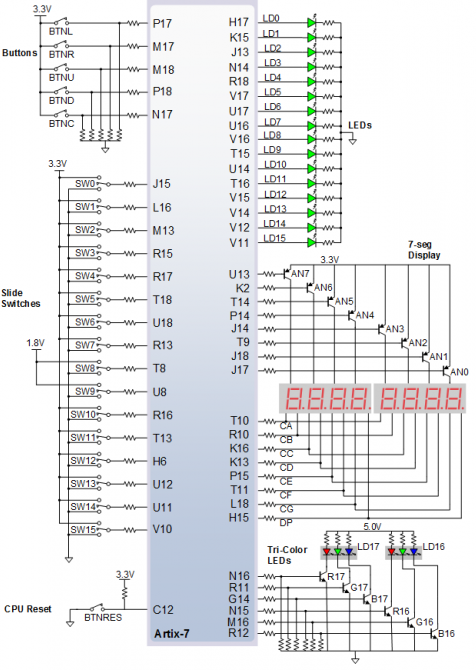
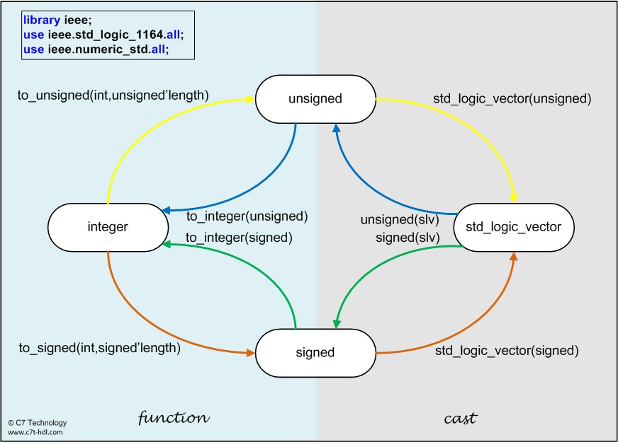

# Lab 4: Arithmetic Logic Unit (ALU)

* [Pre-Lab preparation](#preparation)
* [Part 1: Vector concatenation](#part1)
* [Part 2: Arithmetic Logic Unit (ALU)](#part2)
* [Part 3: Top level VHDL code](#part3)
* [Challenges](#challenges)
* [References](#references)

### Learning objectives

* Understand the concatenate operator (`&`)
* Use data types conversions
* Construct a simple Arithmetic Logic Unit (ALU)
* Understand the basic flag bits
* Practice instantiating VHDL sub-components

<a name="preparation"></a>

## Pre-Lab preparation

1. See [schematic](https://github.com/tomas-fryza/vhdl-labs/blob/master/docs/nexys-a7-sch.pdf) or [reference manual](https://reference.digilentinc.com/reference/programmable-logic/nexys-a7/reference-manual) of the Nexys A7 board and find out the connection of RGB LEDs and how to turn them on and off using BJTs (Bipolar Junction Transistor).

   

<a name="part1"></a>

## Part 1: Vector concatenation (*Vektorové zřetězení*)

In VHDL, the **concatenate operator**, symbolized by the ampersand (`&`), serves as a powerful tool for constructing composite signals by joining two or more vectors or individual bits into a single, unified vector. The concatenate operator also simplifies the implementation of arithmetic and logical operations. For instance, when dealing with unsigned or signed types, designers can easily expand a vector by attaching a zero to the most significant bit to prevent overflow during arithmetic operations.

Despite its apparent simplicity, the concatenate operator must be used with a keen understanding of type compatibility and vector lengths. All operands must share compatible data types, such as `std_logic`, `std_logic_vector`, `unsigned`, or `signed`. Moreover, the resultant vector’s length must align precisely with the signal to which it is assigned; any mismatch leads to synthesis errors. 

```vhdl
-- Combine vectors
signal pattern : std_logic_vector(7 downto 0);

pattern <= "1010" & "1100";  -- Result: "10101100"

-- Bit extension
signal a : std_logic_vector(3 downto 0) := "1010";
signal extended : std_logic_vector(4 downto 0);

extended <= '0' & a;  -- Result: "01010"
```

<a name="part2"></a>

## Part 2: Arithmetic Logic Unit (ALU)

An **Arithmetic Logic Unit (ALU)** is a fundamental component of digital systems, responsible for performing arithmetic and logical operations on binary data. Typically integrated within a microprocessor or a digital signal processor, the ALU executes operations such as addition, subtraction, multiplication, and bitwise functions like AND, OR, XOR, and NOT. It also handles shift operations, which move bits left or right to perform efficient multiplication or division by powers of two. The ALU’s design includes an input section that accepts binary operands, a control unit that selects the specific operation based on control signals (`opcode`), and an output section that provides the result.

More complicated ALUs may handle 64-bit numbers and have many more functions than mentioned above. The ALU that will be discussed here will only be able to perform basic operations on 4-bit numbers.

Additionally, it generates various **status flags**—such as carry, zero, overflow, and negative—which indicate specific conditions resulting from the operation, aiding in decision-making processes within the processor. 

An **opcode** (short for operation code) is a part of a machine language instruction that specifies the operation to be performed by the CPU. It is a binary code that tells the processor which type of action to execute, such as arithmetic operations (addition, subtraction), logical operations (AND, OR, XOR), data movement (load, store), or control flow instructions (jump, branch). Note, that the opcode is typically combined with other parts of the instruction, such as operands (which indicate the data or memory addresses to use), to form a complete machine instruction.

1. Propose a table with a simplified instruction format for the fundamental arithmetic and logical operations that your ALU might support.

   | **Opcode** | **Operation** | **Description** |
   | :-: | :-- | :-- |
   | `000` | **NOT** | Bitwise NOT operation (complement), `NOT A` |
   | `001` | **Addition** | Adds two operands, `A + B` |
   | `010` | **Subtraction** | Subtracts second operand from first, `A - B` |
   | `011` | **Shift Left** | Shifts bits left (multiply by 2), `A << 1` |
   | `100` |  |  |
   | `101` |  |  |
   | `110` |  |  |
   | `111` |  |  |

2. Run Vivado and create a new project:

   1. Project name: `alu`
   2. Project location: your working folder, such as `Documents`
   3. Project type: **RTL Project**
   4. Create a new VHDL source file: `alu_4bit`
   5. Do not add any constraints now
   6. Choose a default board: `Nexys A7-50T`
   7. Click **Finish** to create the project
   8. Define I/O ports of new module:

      | **Port name** | **Direction** | **Type** | **Description** |
      | :-: | :-: | :-- | :-- |
      | `a` | input | `std_logic_vector(3 downto 0)` | 4-bit inputs |
      | `b` | input | `std_logic_vector(3 downto 0)` |  |
      | `opcode` | input | `std_logic_vector(2 downto 0)` | Operation selector |
      | `result` | output | `std_logic_vector(3 downto 0)` | 4-bit output |
      | `carry` | output | `std_logic` | Carry out flag |
      | `zero` | output | `std_logic` | Zero flag |

3. Use a process and finish the architecture by assigning values to all output signals. Make sure to declare a 5-bit vector inside the architecture's declaration section to handle carry operations correctly.

   ```vhdl
   library ieee;
   use ieee.std_logic_1164.all;
   use ieee.numeric_std.all;  -- Package for data type conversions
   ...

   architecture behavioral of alu_4bit is
       signal sig_res : std_logic_vector(4 downto 0);  -- Extra bit for carry
   begin

       p_alu : process (a, b, opcode) is
       begin
           case opcode is
               when "000" =>  -- NOT
                   sig_res <= '0' & not a;

               when "010" =>  -- ADD
                   sig_res <= std_logic_vector(
                       unsigned('0' & a) +
                       unsigned('0' & b)
                   );


               -- WRITE YOUR ALU OPERATIONS HERE


               when others =>
                   sig_res <= b"0_0000";  -- Default case
           end case;
       end process p_alu;

       -- Assign outputs
       result <= sig_res(3 downto 0);  -- Get 4-bit result only
       carry  <= sig_res(4);           -- Carry bit
       zero   <= '1' when sig_res(3 downto 0) = "0000" else
                 '0';                  -- Zero flag

   end architecture behavioral;
   ```

    Some **important notes**:
      * It is highly recommended to use a VHDL formatter, such as [https://g2384.github.io/VHDLFormatter/](https://g2384.github.io/VHDLFormatter/), which helps you maintain a consistent and clean coding style.
      * The arithmetic operator `+` is defined for the `unsigned` data type in VHDL, as part of the `ieee.numeric_std` package, which allows you to perform arithmetic operations directly, such as addition, subtraction, and multiplication.
      * In VHDL, different data types may need to be converted before performing arithmetic operations or other operations. Here's how to convert data types:
        

4. Create a VHDL simulation source file named `alu_4bit_tb` to serve as a [testbench](https://vhdl.lapinoo.net/testbench/) for your ALU. In this testbench, generate various input combinations to test all ALU operations and verify that the outputs are correct.

5. Use **Flow > Open Elaborated design** and see the schematic after RTL analysis. Note that, RTL (Register Transfer Level) represents digital circuit at the abstract level.

<a name="part3"></a>

## Part 3: Top level VHDL code

1. Create a new VHDL design source `top_level` in your project.
2. Define I/O ports as follows.

   | **Port name** | **Direction** | **Type** | **Description** |
   | :-: | :-: | :-- | :-- |
   | `SW_A` | in  | `std_logic_vector(3 downto 0)` | First operand |
   | `SW_B` | in  | `std_logic_vector(3 downto 0)` | Second operand |
   | `SW_OPCODE` | in  | `std_logic_vector(2 downto 0)` | Operation selector |
   | `LED_RESULT` | out | `std_logic_vector(3 downto 0)` | Show result |
   | `LED_RED` | out | `std_logic` | Show output carry flag |
   | `LED_BLUE` | out | `std_logic` | Show zero flag |
   | `CA` | out | `std_logic` | Cathode of segment A |
   | `CB` | out | `std_logic` | Cathode of segment B |
   | `CC` | out | `std_logic` | Cathode of segment C |
   | `CD` | out | `std_logic` | Cathode of segment D |
   | `CE` | out | `std_logic` | Cathode of segment E |
   | `CF` | out | `std_logic` | Cathode of segment F |
   | `CG` | out | `std_logic` | Cathode of segment G |
   | `DP` | out | `std_logic` | Decimal point |
   | `AN` | out | `std_logic_vector(7 downto 0)` | Common anodes of all on-board displays |

2. Copy design source file `bin2seg.vhd` from the previous lab to `YOUR-PROJECT-FOLDER/alu.srcs/sources_1/new/` folder and add it to the project.

3. Use component declaration and instantiation of `alu_4bit` and `bin2seg`, and define the top-level architecture as follows.

   

   ```vhdl
   architecture behavioral of top_level is
       -- Component declaration for 4-bit alu


       -- Component declaration for bin2seg


       -- Local signal for alu result


   begin

       -- Component instantiation of 4-bit alu


       -- Component instantiation of bin2seg


       -- Turn off decimal point


       -- Display output value on LEDs


       -- Set display position


   end architecture behavioral;
   ```

4. Create a new [constraints XDC](https://raw.githubusercontent.com/Digilent/digilent-xdc/master/Nexys-A7-50T-Master.xdc) file `nexys-a7-50t`, uncomment and modify names of used pins according to the `top_level` entity.

5. Compile the project (ie. transform the high-level VHDL code into a binary configuration file) and download the generated bitstream `YOUR-PROJECT-FOLDER/alu.runs/impl_1/top_level.bit` into the FPGA chip.

6. Test the functionality of the adder by toggling the switches and observing display and LEDs.

7. Use **Flow > Open Elaborated design** and see the schematic after RTL analysis.

<a name="challenges"></a>

## Challenges

1. Design a 4-bit binary multiplier in VHDL that multiplies two unsigned 4-bit numbers and outputs an 8-bit result. Implement both the architecture and a testbench to verify the functionality.

   Use the result from the previous lab challenge and display the result on two 7-segment displays.

## References

1. Digilent Reference. [Nexys A7 Reference Manual](https://digilent.com/reference/programmable-logic/nexys-a7/reference-manual)

2. Digilent. [General .xdc file for the Nexys A7-50T](https://github.com/Digilent/digilent-xdc/blob/master/Nexys-A7-50T-Master.xdc)

3. [VHDL Beautifier, Formatter](https://g2384.github.io/VHDLFormatter/)
