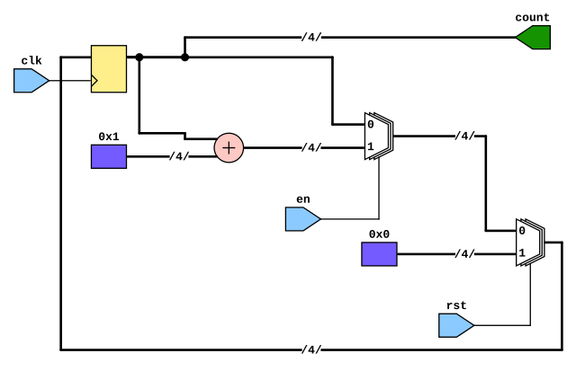
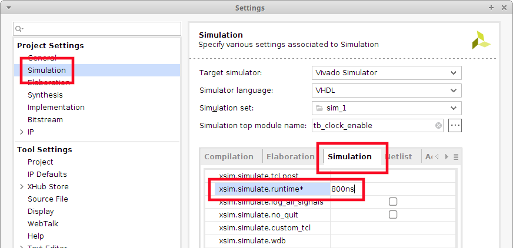
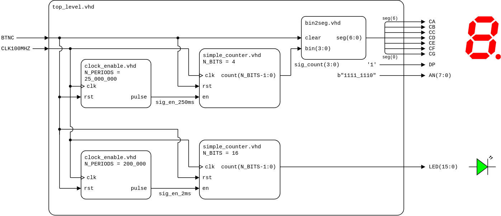

# Lab 5: Binary counter

* [Pre-Lab preparation](#preparation)
* [Part 1: VHDL code for simple counter](#part1)
* [Part 2: VHDL generics](#part2)
* [Part 3: VHDL code for clock enable](#part3)
* [Part 4: Top level VHDL code](#part4)
* [Challenges](#challenges)
* [References](#references)

### Learning objectives

After completing this lab you will be able to:

* Understand binary counters
* Use VHDL generics and synchronous processes
* Use clock enable signal to drive another logic in the design (with slower clock)

The purpose of this laboratory exercise is to become familiar with the creation of sequential processes in VHDL, next to implement a clock enable signal to drive another logic with slower clock, and to design a binary counter.

<a name="preparation"></a>

## Pre-Lab preparation

1. Calculate how many periods of clock signal with frequency of 100&nbsp;MHz contain time intervals 2&nbsp;ms, 4&nbsp;ms, 10&nbsp;ms, 250&nbsp;ms, 500&nbsp;ms, and 1&nbsp;s. Write values in decimal, binary, and hexadecimal forms.

   &nbsp;
   
   &nbsp;

   
   &nbsp;

<!--
https://editor.codecogs.com/
T_{clk}=\frac{1}{f_{clk}}=
\textup{number of clk period} = \frac{\textup{time interval}}{T_{clk}}=
-->

   | **Time interval** | **Number of clk periods** | **Number of clk periods in hex** | **Number of clk periods in binary** | **Number of bits** |
   | :-: | :-: | :-: | :-: |
   | 2&nbsp;ms | 200_000 | `x"3_0d40"` | `b"0011_0000_1101_0100_0000"` | 18 |
   | 4&nbsp;ms |  |  |  |  |
   | 10&nbsp;ms |  |  |  |  |
   | 250&nbsp;ms | 25_000_000 | x"17d_7840" | b"0001_0111_1101_0111_1000_0100_0000" | 25 |
   | 500&nbsp;ms |  |  |  |
   | 1&nbsp;sec | 100_000_000 | `x"5F5_E100"` | `b"0101_1111_0101_1110_0001_0000_0000"` | 27 |

2. See [schematic](https://github.com/tomas-fryza/vhdl-course/blob/master/docs/nexys-a7-sch.pdf) or [reference manual](https://reference.digilentinc.com/reference/programmable-logic/nexys-a7/reference-manual) of the Nexys A7 board and find out the connection of Pmod ports, ie to which FPGA pins are connected. What is the usage of such connectors?

   

<a name="part1"></a>

## Part 1: VHDL code for simple counter

A simple **N-bit counter** is a digital circuit and has N output bits representing the count value. It counts up sequentially from `0` to `2^N-1`, where `N` is the number of bits and then wraps around back to 0. When the reset signal is asserted, the counter is reset to 0. Many digital circuits have a **clock enable** input. This signal is used to enable or disable the counting operation of the counter. When the clock enable signal is active (typically high), the counter counts normally with the clock input. When the clock enable signal is inactive (typically low), the counter holds its current value and does not count.


> The figure above was created in [WaveDrom](https://wavedrom.com/) digital timing diagram online tool. The figure source code is as follows:
> 
> ```javascript
> {
>   signal: [
>     ["inputs",
>       {name: "clk", wave: 'P.................'},
>       {name: "rst", wave: 'lnhpl.............'},
>       {name: "en",  wave: 'h.............pl..'},
>     ],
>     {},
>     {name: "count[2:0]", wave: 'x.3.33333333333...', data: ["0","1","2","3","4","5","6","7","0","1","2","3"]},
>   ],
> }
> ```

1. Run Vivado, create a new project and implement a 4-bit up counter with active-high reset and enable input:

   1. Project name: `counter`
   2. Project location: your working folder, such as `Documents`
   3. Project type: **RTL Project**
   4. Create a VHDL source file: `simple_counter`
   5. Do not add any constraints now
   6. Choose a default board: `Nexys A7-50T`
   7. Click **Finish** to create the project
   8. Define I/O ports of new module:

      | **Port name** | **Direction** | **Type** | **Description** |
      | :-: | :-: | :-- | :-- |
      | `clk`   | input  | `std_logic` | Main clock |
      | `rst`   | input  | `std_logic` | High-active synchronous reset |
      | `en`    | input  | `std_logic` | Clock enable input |
      | `count` | output | `std_logic_vector(3 downto 0)` | Counter value |

2. Use VHDL templates in menu **Tools > Language Templates**, search for `up counters`, and select the one using clock enable (CE) and synchronous active-high reset. Copy/paste this template to the architecture and modify the code according to your I/O port names.

   ```vhdl
   architecture behavioral of simple_counter is
       ...
   begin

       process (<clock>)
       begin
       if <clock>='1' and <clock>'event then
           if <reset>='1' then
               <count> <= (others => '0');
           elsif <clock_enable>='1' then
               <count> <= <count> + 1;
           end if;
       end if;
       end process;

   end behavioral;
   ```

   Hints:
      * Use `rising_edge(clk)` instead of `clk='1' and clk'event` to test clock edge
      * Statement `(others => '0')` initializes all elements of the array to binary zero
      * Declare an internal signal `sig_count` of data type `std_logic_vector(3 downto 0)` to implement the counter. This is because the **output** port `count` cannot be read and therefore the operation `count + 1` cannot be performed
      * Add `use ieee.std_logic_unsigned.all;` package to use arithmetic operations with `std_logic_vector` data type
      * Outside the process, connect internal signal to counter output

   

3. Create [testbench](https://vhdl.lapinoo.net/testbench/) file `tb_simple_counter`, run the simulation, and test the functionality of `rst` and `en` signals.

   > Note that for any vector, it is possible to change the numeric system in the simulation which represents the current value. To do so, right-click the vector name and select **Radix > Unsigned Decimal** from the context menu. You can change the vector color by **Signal Color** as well.

<!--
   > 
-->

4. Use **Flow > Open Elaborated design** and see the schematic after RTL analysis. Note that RTL (Register Transfer Level) represents digital circuit at the abstract level.

5. Use **Flow > Synthesis > Run Synthesis** and then see the schematic at the gate level.

<a name="part2"></a>

## Part 2: VHDL generics

A VHDL **generic** allows the designer to parametrize the entity during the component instantiation and it is a great way to create modular code that can be quickly changed to accomodate a wide variety of designs. Since a generic cannot be modified inside the architecture, it is like a constant.

Instead of writing:

   ```vhdl
   entity some_entity is
       port (
           clk     : in    std_logic;
           counter : out   std_logic_vector(3 downto 0) -- Hard coded to be 4 bits long
       );
   end entity some_entity;
   ```

We can write:

   ```vhdl
   entity some_entity is
       generic (
           N : integer := some_defaul_value
       );
       port (
           clk     : in    std_logic;
           counter : out   std_logic_vector(N-1 downto 0) -- Can be any width
           -- (the desired width will be passed during instantiation in the generic map)
       );
   end entity some_entity;
   ```

1. Extend the code from the previous part and use generics in both, design and testbench sources.

   In **design source**, use generic `N` to define number of bits for the counter. In **testbench**, define a constant, prior to declaring the component and use it to declare your internal counter signal:

   ```vhdl
   -- Design source file
   entity simple_counter is
       generic (
           N : integer := 4 --! Default number of bits
       );
       port (
           ...
       );
   end entity simple_counter;
   ```

   ```vhdl
   -- Testbench file
   constant COUNTER_WIDTH : integer := 6; --! Simulating number of bits
   signal count : std_logic_vector(COUNTER_WIDTH-1 downto 0);
   ```

   When you instantiate your counter, you then also bind the `N` generic to this constant:

   ```vhdl
   dut : component simple_counter
       generic map (
           N => COUNTER_WIDTH
       )
       ...
   ```

2. Simulate your design and try several `COUNTER_WIDTH` values.

<a name="part3"></a>

## Part 3: VHDL code for clock enable

To drive another logic in the design (with slower clock), it is better to generate a **clock enable signal** (see figure bellow) instead of creating another clock domain (using clock dividers) that would cause timing issues or clock domain crossing problems such as metastability, data loss, and data incoherency.


> ```javascript
> {
>   signal: [
>     ["inputs",
>       {name: "clk", wave: 'P.................'},
>       {name: "rst", wave: 'lnhpl.............'},
>     ],
>     {},
>     ["internal",
>       {name: "sig_count[2:0]", wave: 'x.3.33333333333333', data: ["0","1","2","3","4","5","0","1","2","3","4","5","0","1","2",]},
>     ],
>     {},
>     ["output",
>       {name: "pulse", wave: 'l........hl....hl.'},
>     ],
>   ],
>   head: {
>   },
>   foot: {
>     text:'PERIOD = 6',
>   },
> }
> ```

1. Create a new VHDL source file: `clock_enable` and define I/O ports as follows:

   | **Port name** | **Direction** | **Type** | **Description**
   | :-: | :-: | :-- | :--
   | `clk`   | input  | `std_logic` | Main clock
   | `rst`   | input  | `std_logic` | High-active synchronous reset
   | `pulse` | output | `std_logic` | Clock enable pulse signal

2. Add generic `PERIOD` to the entity defining the default number of clk periodes to generate one pulse.

   ```vhdl
   entity clock_enable is
       generic (
           PERIOD : integer := 6
       );
       port (
           ...
       );
   end entity clock_enable;
   ```

3. In architecture declaration part, define a local counter with a width calculated from the number of needed bits for `PERIOD`. To use math functions, add a new package to your VHDL file.

   ```vhdl
   library ieee;
       use ieee.std_logic_1164.all;
       use ieee.std_logic_unsigned.all; -- Package for arithmetic operations with std_logic_vector
       use ieee.math_real.all; -- To calculate the number of bits needed to represent an integer

   ...
   architecture behavioral of clock_enable is
       --! Get number for needed bits for PERIOD value
       constant bits_needed : integer := integer(ceil(log2(real(PERIOD + 1))));

       --! Local counter with needed number of bits
       signal sig_count : std_logic_vector(bits_needed - 1 downto 0);
   begin
   ```

4. Complete the architecture to define the `clock_enable` according to the following structure.

   

   ```vhdl
   begin
       --! Generate clock enable signal. By default, enable signal
       --! is low and generated pulse is always one clock long.
       p_clk_enable : process (clk) is
       begin

           -- Synchronous proces
           if (rising_edge(clk)) then
               -- if high-active reset then

                   -- Clear all bits of local counter
                   -- Set output `pulse` to low

               -- elsif sig_count is PERIOD-1 then
                   -- Clear all bits of local counter
                   -- Set output `pulse` to high

               -- else
                   -- Increment local counter
                   -- Set output `pulse` to low

               -- Each `if` must end by `end if`
           end if;

       end process p_clk_enable;

   end architecture behavioral;
   ```

5. Use **Flow > Open Elaborated design** and see the schematic after RTL analysis.

6. Create a VHDL simulation source `tb_clock_enable`, simulate reset functionality and 100 clock periodes. Test several `PERIOD` values within your testbench.

   > **Solution:** [https://www.edaplayground.com/x/5LiJ](https://www.edaplayground.com/x/5LiJ)

   > **Note:** To change the testbench you want to simulate, right click to testbench file name and select `Set as Top`.
   >
   > 

   > **Note:** The default simulation run time in Vivado is set to 1000&nbsp;ns You can change it in the menu **Tools > Settings...**
   >
   > 

<a name="part4"></a>

## Part 4: Top level VHDL code

1. Create a new VHDL design source `top_level` in your project and implement the 4-bit up counter on the Nexys A7 board. Let the counter value increments every 250 ms and it is show on 7-segment display.

2. Use **Define Module** dialog and define I/O ports as follows.

   | **Port name** | **Direction** | **Type** | **Description** |
   | :-: | :-: | :-- | :-- |
   | `CLK100MHZ` | in  | `std_logic` | Main clock |
   | `CA` | out | `std_logic` | Cathode of segment A |
   | `CB` | out | `std_logic` | Cathode of segment B |
   | `CC` | out | `std_logic` | Cathode of segment C |
   | `CD` | out | `std_logic` | Cathode of segment D |
   | `CE` | out | `std_logic` | Cathode of segment E |
   | `CF` | out | `std_logic` | Cathode of segment F |
   | `CG` | out | `std_logic` | Cathode of segment G |
   | `DP` | out | `std_logic` | Decimal point |
   | `AN` | out | `std_logic_vector(7 downto 0)` | Common anodes of all on-board displays |
   | `BTNC` | in  | `std_logic` | High-active synchronous reset |

3. Copy design source file `bin2seg.vhd` from the previous lab to `YOUR-PROJECT-FOLDER/counter.srcs/sources_1/new/` folder and add it to the project.

4. Use component declaration and instantiation of `simple_counter`, `clock_enable`, and `bin2seg`, and define the top-level architecture as follows.

   

   ```vhdl
   architecture behavioral of top_level is
       -- Component declaration for clock enable


       -- Component declaration for simple counter


       -- Component declaration for bin2seg


       -- Local signals for a counter: 4-bit @ 250 ms


   begin

       -- Component instantiation of clock enable for 250 ms


       -- Component instantiation of 4-bit simple counter


       -- Component instantiation of bin2seg


       -- Turn off decimal point


       -- Set display position


   end architecture behavioral;
   ```

5. Create a new [constraints XDC](https://raw.githubusercontent.com/Digilent/digilent-xdc/master/Nexys-A7-50T-Master.xdc) file `nexys-a7-50t`, uncomment and modify names of used pins according to the `top_level` entity.

6. Compile the project (ie. transform the high-level VHDL code into a binary configuration file) and download the generated bitstream `YOUR-PROJECT-FOLDER/counter.runs/impl_1/top_level.bit` into the FPGA chip.

7. Use **Flow > Open Elaborated design** and see the schematic after RTL analysis.

8. Optional: Use digital oscilloscope or logic analyser and display counter values via Pmod ports of the Nexys A7 board.

<a name="challenges"></a>

## Challenges

1. Add a second instantiation (copy) of the counter and clock enable entities and make a 16-bit counter with a 2 ms time base. Display the counter values on LEDs.

   

2. Create a new component `up_down_counter` implementing bi-directional (up/down) binary counter.

<a name="references"></a>

## References

1. Digilent blog. [Nexys A7 Reference Manual](https://reference.digilentinc.com/reference/programmable-logic/nexys-a7/reference-manual)

2. [WaveDrom - Digital Timing Diagram everywhere](https://wavedrom.com/)

3. Tomas Fryza. [Template for clock enable module](https://www.edaplayground.com/x/Vdpu)

4. Tomas Fryza. [Template for bi-directional counter](https://www.edaplayground.com/x/5bgq)

5. Digilent. [General .xdc file for the Nexys A7-50T](https://github.com/Digilent/digilent-xdc/blob/master/Nexys-A7-50T-Master.xdc)
