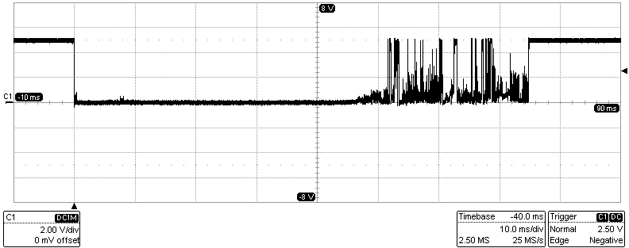
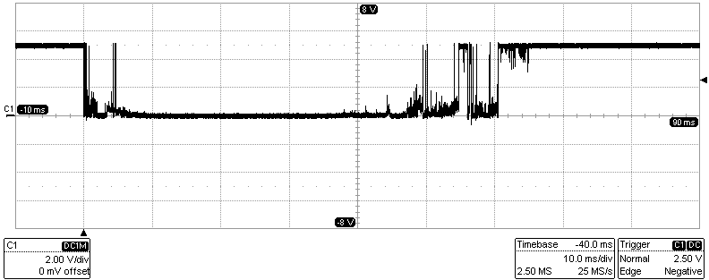
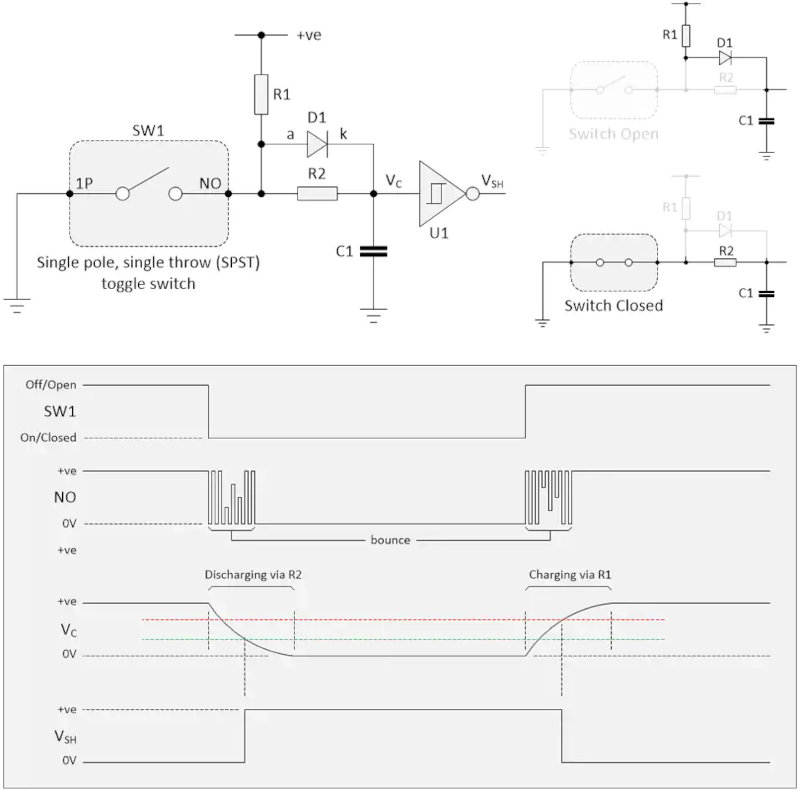
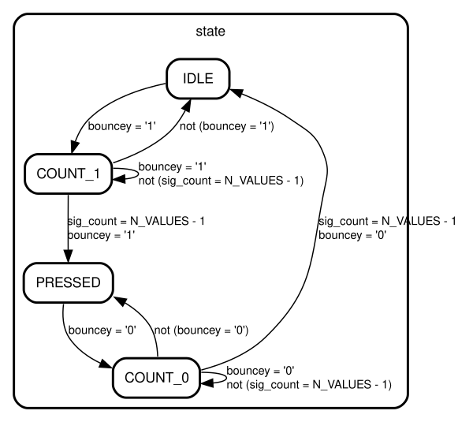

# Lab 8: FSM debouncer

* [Pre-Lab preparation](#preparation)
* [Part 1: Finite State Machine (FSM)](#part1)
* [Part 2: Button bounce](#part2)
* [Part 3: FSM debouncer in VHDL](#part3)
* [Part 4: Edge detector](#part4)
* [Challenges](#challenges)
* [References](#references)

### Learning objectives

After completing this lab you will be able to:

* Understand the philosophy and use of finite state machines
* Use state diagrams
* Understand the difference between Mealy and Moore type of FSM in VHDL
* Understand the button bounce effect and how to debounce it
* Use edge detectors

<a name="preparation"></a>

## Pre-Lab preparation

1. The Nexys A7 board provides five push buttons. See [schematic](https://github.com/tomas-fryza/vhdl-course/blob/master/docs/nexys-a7-sch.pdf) or [reference manual](https://reference.digilentinc.com/reference/programmable-logic/nexys-a7/reference-manual) of the Nexys A7 board and find out the connection of these push-buttons and the active level.

   

2. Optional: See video tutorial [Implementing the candy-lock FSM in VHDL](https://www.youtube.com/watch?v=5kC1XEWhIFQ)

<a name="part1"></a>

## Part 1: Finite State Machine (FSM)

A **Finite State Machine (FSM)** is a mathematical model used to describe and represent the behavior of systems that can be in a finite number of states at any given time. It consists of a set of states, transitions between these states, and actions associated with these transitions.

The main properties of using FSMs include:

   1. **Determinism**: FSMs are deterministic if, for each state and input, there is exactly one transition to a next state. This property simplifies analysis and implementation.

   2. **State Memory**: FSMs inherently have memory as they retain information about their current state. This allows them to model systems with sequential behavior.

   3. **Simplicity**: FSMs are relatively simple and intuitive to understand, making them useful for modeling and designing systems with discrete and sequential behavior.

   4. **Parallelism**: FSMs can represent parallelism by having multiple state machines working concurrently, each handling different aspects of the system.

The main types of FSMs include Moore Machine and Mealy Machine. In a **Moore machine**, outputs are associated with states (see [figure](https://www.allaboutcircuits.com/technical-articles/implementing-a-finite-state-machine-in-vhdl/) bellow), while in a **Mealy machine**, outputs are associated with transitions between states. This means that Moore machines produce outputs only after transitioning to a new state, while Mealy machines can produce outputs immediately upon receiving an input.

   

One widely used method to illustrate a finite state machine is through a **state diagram**, comprising circles connected by directed arcs. Each circle denotes a machine state labeled with its name, and, in the case of a Moore machine, an [output value](https://ocw.mit.edu/courses/electrical-engineering-and-computer-science/6-004-computation-structures-spring-2017/c6/c6s1/) associated with the state.

   

Directed arcs signify the transitions between states in a finite state machine (FSM). For a Mealy machine, these arcs are labeled with input/output pairs, while for a Moore machine, they are labeled solely with inputs.

   

<a name="part2"></a>

## Part 2: Button bounce

A **bouncy button**, also known as a "bouncing switch" or "switch bounce," refers to the phenomenon where the electrical contacts in a mechanical switch make multiple, rapid transitions between open and closed states when pressed or released. This can lead to multiple erroneous signals being sent to a circuit. Examples of real push buttons can be seen below. (Note that, the active level of the button here is low.)

   

   

The main methods to debounce a bouncy button are:

   1. **[Hardware Debouncing](https://www.digikey.ee/en/articles/how-to-implement-hardware-debounce-for-switches-and-relays)**: Hardware debouncing involves adding additional circuitry or components to the switch or input signal path to eliminate or reduce the effects of bouncing, such as capacitors, resistors, and Schmitt triggers.

      

   2. **Software Debouncing**: This method involves using software algorithms to filter out the noise and ensure that only a single, stable signal transition is recognized. Common techniques include implementing delay-based algorithms, state machines, or using timers.

   3. **Combination Approach**: Often, a combination of software and hardware debouncing methods is employed to achieve robust debouncing.

<a name="part3"></a>

## Part 3: FSM debouncer in VHDL

1. Run Vivado, create a new project and implement an FSM version of software debouncer with clock enable and reset:

   1. Project name: `fsm`
   2. Project location: your working folder, such as `Documents`
   3. Project type: **RTL Project**
   4. Create a VHDL source file: `debounce`
   5. Do not add any constraints now
   6. Choose a default board: `Nexys A7-50T`
   7. Click **Finish** to create the project
   8. Define I/O ports of new module:

      | **Port name** | **Direction** | **Type** | **Description** |
      | :-: | :-: | :-- | :-- |
      | `clk`   | input  | `std_logic` | Main clock |
      | `rst`   | input  | `std_logic` | High-active synchronous reset |
      | `en`    | input  | `std_logic` | Clock enable input |
      | `bouncey` | input  | `std_logic` | Button input |
      | `clean` | output | `std_logic` | Debounced button output |

2. The inactive level of the on-board push buttons is low. Periodically read the button signal, and if the value is high, start counting a sequence of consecutive high values. If there is an uninterrupted sequence of `DEB_COUNT = 4` high values, consider the button pressed. The counter resets to zero upon receiving a low sample. When releasing the button, the FSM counts the same number of low-value samples before considering the button released.

   

   Define four states for the FSM and an internal counter in the architecture declaration section to count a sequence of unchanged button signal values. Additionally, define a debounced signal required later for the edge detector.

      ```vhdl
      architecture behavioral of debounce is
          -- Define states for the FSM
          type   state_type is (RELEASED, PRE_PRESSED, PRESSED, PRE_RELEASED);
          signal state : state_type;

          -- Define number of periods for debounce counter
          constant DEB_COUNT : integer := 4;

          -- Define signals for debounce counter
          signal sig_count : integer range 0 to DEB_COUNT;

          -- Debounced signal
          signal sig_clean : std_logic;
      begin
          ...
      ```

3. Complete the architecture body section according to the state diagram above.

   ```vhdl
   begin

       -- Process implementing a finite state machine (FSM) for
       -- button debouncing. Handles transitions between different
       -- states based on clock signal and bouncey button input.
       p_fsm : process (clk) is
       begin

           if rising_edge(clk) then
               -- Active-high reset
               if (rst = '1') then
                   state <= RELEASED;
               -- Clock enable
               elsif (en = '1') then
                   -- Define transitions between states
                   case state is

                       when RELEASED =>
                           -- If bouncey button = 1 then clear counter and change to PRE_PRESSED;

                       when PRE_PRESSED =>
                           -- If button = 1 increment counter

                               -- if counter = DEB_PERIODS-1 change to PRESSED

                           -- else change to RELEASED

                       when PRESSED =>
                           -- If button = 0 then clear counter and change to PRE_RELEASED;

                       when PRE_RELEASED =>
                           -- If button = 0 then increment counter

                               -- if counter = DEB_PERIODS-1 change to RELEASED;

                           -- else clear counter and change to PRESSED;

                       -- Prevent unhandled cases
                       when others =>
                           null;
                   end case;
               end if;
           end if;

       end process p_fsm;

       -- Set clean signal value = 1 when states PRESSED or PRE_RELEASED


       -- Assign output debounced signal
       clean <= sig_clean;

   end architecture behavioral;
   ```

4. Use **Flow > Open Elaborated design** and see the schematic after RTL analysis.

5. Generate a [simulation source](https://vhdl.lapinoo.net/testbench/) named `tb_debounce`, execute the simulation, and validate the functionality of enable, reset, and debouncing.

   > **Note:** To display internal signal values, follow these steps:
   > 1. Select 'dut' in the **Scope** folder.
   > 2. Right-click on the 'state' signal name in the **Objects** folder.
   > 3. Add this signal by selecting the **Add to Wave Window** command.
   > 4. Click on the **Relaunch Simulation** icon.
   >
   >    


   TODO: Figure of possible simulation output


<a name="part4"></a>

## Part 4: Edge detector

A positive **edge detector** generates a single clock pulse when the input signal transitions from low to high, while a negative edge detector generates a pulse when the input transitions from high to low. The VHDL code captures these transitions by comparing the current signal state with the previous one using `and` and `not` gates, outputting single clock pulses accordingly.


```javascript
{
  signal: [
    {name: "clk",     wave: 'P.................'},
    {name: "clean",   wave: 'l...h.......l.....'},
    {name: "delayed", wave: 'l....h.......l....'},
    {},
    {name: "pos_edge", wave: 'l...hl............'},
    {name: "neg_edge", wave: 'l...........hl....'},
  ],
}
```

1. Add both edge detectors to `debounce` component:
   1. Define new entity outputs `pos_edge` and `neg_edge` as `std_logic`
   2. Define `sig_delayed` signal as `std_logic`
   3. Add new `p_edge_detector` process to the architecture body and define `pos_edge` and `neg_edge` output values

      ```vhdl
          -- Remember the previous value of a signal and generates single
          -- clock pulses for positive and negative edges of the debounced signal.
          p_edge_detector : process (clk) is
          begin
              if rising_edge(clk) then
                  if (rst = '1') then
                      sig_delayed <= '0';
                  else
                      sig_delayed <= sig_clean;
                  end if;
              end if;
          end process p_edge_detector;

          -- Assign output signals for edge detector


      end architecture behavioral;
      ```

2. Add new edge detector outputs to simulation source `tb_debounce` and relaunch the simulation.


   TODO: Figure of possible simulation output


<a name="challenges"></a>

## Challenges

1. Create a VHDL design source named `top_level` and implement a button-triggered 4-bit simple counter on the Nexys A7 board. Read `BTNR` button every 2 milliseconds and on rising edge of clean/debounced signal increment the counter value on the LEDs.

   Use component declarations and instantiations of `clock_enable`, `debounce` and `simple_counter`, and define the top-level architecture as follows. Use reserved keyword `open` when you instantiate a module that has an output that is not needed.

   

   **Note:** The `enable_clock` and `simple_counter` components from the previous labs are required. Do not forget to copy both files to `YOUR-PROJECT-FOLDER/debounce.srcs/sources_1/new/` folder and add them to the project.

<a name="references"></a>

## References

1. David Williams. [Implementing a Finite State Machine in VHDL](https://www.allaboutcircuits.com/technical-articles/implementing-a-finite-state-machine-in-vhdl/)

2. MIT OpenCourseWare. [L06: Finite State Machines](https://ocw.mit.edu/courses/electrical-engineering-and-computer-science/6-004-computation-structures-spring-2017/c6/c6s1/)

3. VHDLwhiz. [One-process vs two-process vs three-process state machine](https://vhdlwhiz.com/n-process-state-machine/)

4. Clive Maxfield. [How to Implement Hardware Debounce for Switches and Relays When Software Debounce Isn’t Appropriate](https://www.digikey.ee/en/articles/how-to-implement-hardware-debounce-for-switches-and-relays)
