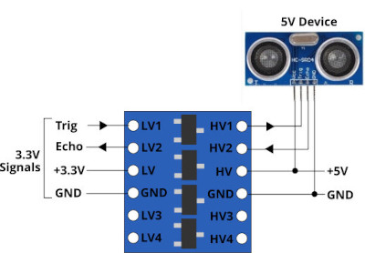
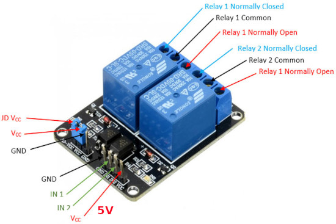
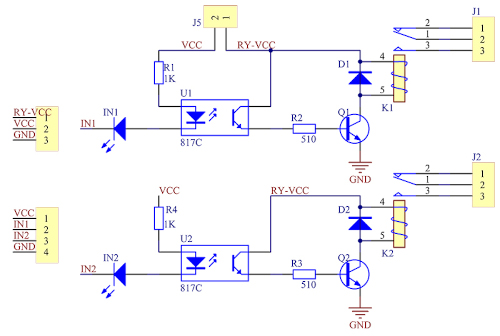
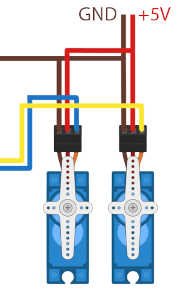

# VHDL project

### Topics

*Topics will be presented one week before the project starts.*

**Topic 1: Smart Parking System with Ultrasonic Sensors**

Description: Design and implement a smart parking system using VHDL on the Nexys A7 FPGA board. The system will utilize multiple ultrasonic sensors (HS-SR04) connected to the Pmod connectors for detecting the presence and distance of vehicles within parking spaces. Develop algorithms to analyze sensor data and determine parking space availability. Visualize parking space occupancy status using LEDs, while displaying distance measurements on the 7-segment display.

**Topic 2: Relay-Controlled Sound Synthesizer**

Description: Develop and implement a sound synthesizer utilizing relays on the Nexys A7 FPGA board. Rather than generating audio signals directly, the system employs relays connected to Pmod connectors to produce audible sounds by managing the activation and deactivation of relay switches. Users can compose and play basic melodies by programming the relay sequences. Push buttons will serve as controls for play, stop, and song navigation, while LEDs and a 7-segment display will provide visualization of the melody and information about the songs.

**Topic 3: PWM-Based Servo Motor Controller**

Description: Develop a PWM-based servo motor controller using VHDL on the Nexys A7 FPGA board. Utilize the FPGA's PWM output capability to generate signals for controlling multiple independent servo motors connected to the Pmod connectors. Implement algorithms to adjust the angle of the servo motors based on user input received from buttons or switches. LEDs will offer visual feedback on the servo position or controller status.

**Topic 4: PWM-Based Tone Generator**

Description: Develop a tone generator using PWM on the audio jack connector of the Nexys A7 FPGA board to produce simple musical tones or melodies. Users will be able to adjust parameters such as frequency and duration using buttons or switches. LEDs will offer visual indication of the currently generated tone.

**Topic 5: Implementation of Basic Ciphers**

Description: This project aims to demonstrate various simple ciphers, such as the Vernam Cipher, Caesar Cipher, Atbash Cipher, and potentially others, using basic logic gates and flip-flops on the Nexys A7 FPGA board. Each cipher enabling users to input plaintext messages and observe the resulting ciphertext generated by the encryption process. Buttons and switches can serve as input devices for users to input plaintext messages and control the encryption/decryption process. LEDs can provide visual feedback on the status of the encryption/decryption process, indicating *ready to receive input*, *encryption/decryption in progress*, and *complete*. The 7-segment display shows the ciphertext or plaintext output.

**Advanced Topic 1: Digital Voltmeter with Voltage Data Logging**

Description: This project involves the development of a digital voltmeter using VHDL on the Nexys A7 FPGA board to accurately measure and log voltage levels. The system will interface with analog-to-digital converters (ADC) via the Pmod connectors to sample voltage signals from external sources. The measured voltage will be displayed in real-time on the 7-segment display for user visualization. LEDs will provide visual feedback on the measurement status or indicate voltage thresholds. Additionally, the system can log the voltage data to an external memory device for future analysis.

**Advanced Topic 2: VGA Image Rendering and Manipulation**

Description: This project involves the development of generating images using VGA output on the Nexys A7 FPGA board. The system will implement algorithms for image rendering and manipulation, enabling the creation of basic shapes, patterns, and color gradients. It will adhere to VGA timing specifications for pixel generation and synchronization, ensuring compatibility with standard VGA displays.

## Instructions

The objective of this group project is to collaborate within small teams of 3-4 students, explore a chosen topic, utilize lab components, develop innovative solutions, simulate and execute these solutions, generate project documentation, and present the final outcomes. Team members are responsible for organizing and assigning roles and tasks among themselves.

* Students will work on the project in the lab during Weeks 8 to 12 (or 13) of the semester, culminating in a practical demonstration.

* Students must submit a link to their GitHub repository containing the VHDL project, required images, documents, and a descriptive README file. The submission deadline is the day before the practical demonstration.

* All FPGA code must be written in VHDL and must be implementable on the Nexys A7-50T board using the development tools provided during the semester, specifically Vivado.

* Use components designed and tested during the semester.

* Follow ethical rules regarding plagiarism, licensing, and policies for the use of [generative artificial intelligence](https://www.vut.cz/vut/aktuality-f19528/vut-vydalo-zasady-a-doporuceni-k-vyuzivani-generativni-umele-inteligence-d247152).

* Provide detailed simulation testbenches for all your new components.

* Physical implementation on FPGA is necessary, not just computer simulation.

* Teams should create a short video (<1 min.) demonstrating their application. This video can be used to promote the course on LinkedIn.

## Help

* **Never, ever** use `rising_edge` or `falling_edge` to test edges of non-clock signals under any circumstances!

* Use hierarchical design, ie. instances, top-level, several files, etc.

* Use synchronous entities with rising `clk`.

* In a synchronous process, the first thing to do is the test of clock edge, then synchronous reset. The only exception is asynchronous operations (try to avoid them).

* Use only input `in` or output `out` ports and not ~~inout~~.

* Use `wait` statements [only in simulations](https://www.vhdl-online.de/courses/system_design/vhdl_language_and_syntax/sequential_statements/wait_statement).

* Except Vivado, we encourage the use of other tools as well:
   * [EDA Playground](https://www.edaplayground.com/)
   * [TerosHDL](https://github.com/tomas-fryza/vhdl-course/wiki/How-to-install-TerosHDL-on-Windows-and-Linux)
   * [ghdl + GtkWave](https://github.com/tomas-fryza/vhdl-course/wiki/How-to-install-ghdl-on-Windows-and-Linux)
   * [ModelSim](https://www.intel.com/content/www/us/en/software-kit/750666/modelsim-intel-fpgas-standard-edition-software-version-20-1-1.html)
   * [Live Share](https://code.visualstudio.com/learn/collaboration/live-share), a Visual Studio Code plugin for a real-time collaborative development
   * [other tools](https://github.com/tomas-fryza/vhdl-course/wiki)

# Recommended README.md file structure

### Team members

* Member 1 (responsible for ...)
* Member 2 (responsible for ...)
* Member 3 (responsible for ...)
* Member 4 (responsible for ...)

## Theoretical description and explanation

Enter a description of the problem and how to solve it.

## Hardware description of demo application

Insert descriptive text and schematic(s) of your implementation.

## Software description

Put flowchats/state diagrams of your algorithm(s) and direct links to source/testbench files in `src` and `sim` folders. 

### Component(s) simulation

Write descriptive text and put simulation screenshots of your components.

## Instructions

Write an instruction manual for your application, including photos and a link to a short app video.

## References

1. Put here all references to sources and tools you used.
2. ...
